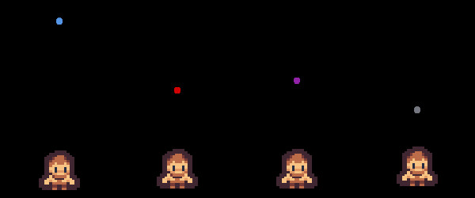

# Devlog 1 — 01-Jun-2023

After spending months working on this title, I feel it's time to start a devlog.

## Wait, why are you making a devlog?

It may take away development time, it may go unseen, and anyone who _does_ see it will probably think I'm an idiot, but creating a devlog seems like a useful thing to do for a number of reasons.

-   **High Level Overview:** Writing a devlog gives me a high level overview of the project. It gives me a good picture of the goal, so I won't get stuck in the weeds.
-   **Motivation:** I hope documenting the game will give me examples to point back to and see how far I've come, which will drive me to continue working and reaching that goal.
-   **Planning:** Similar to the high level overview, the devlog is here to map my route and help me course-correct if I feel like I'm going astray.

## What's the game about anyway?

The game was inspired by Game Off 2022's theme of "cliche". I was playing a lot of D&D and consuming a lot of related content, so I wanted to make a game about D&D cliches. The central premise is a mix of the hero's journey and the joke about bards seducing dragons.

Ultimately, it's a fantasy game about a bard overcoming obstacles and defeating the evil sorcerer who's trying to destroy the world. Along the way, he recruits friends, defeats villains, and seduces dragons.

Mechanically, the game is meant to involve minor visual novel elements for the storytelling and dialogue. It will also involve bullet-hell gameplay where the bard avoids enemy attacks and shoots out their own magical attacks (which produce pretty musical notes).

## What have you done so far?

Development has mainly been focused on the combat, with player controls, health, and attacks being fully completed. Other essential systems (like pause and options) have also been created.

Just this week I finished setting up different attack types which will have their own properties.

-   **Regular:** Regular attacks will do medium damage, but won't have any effects. They'll probably penetrate (and destroy) all enemy projectiles encountered, so you can use it as a defensive tool as well.
-   **Fire:** This will do low damage and travel at a medium pace, but it will light enemies on fire to continue doing damage. It also pierces enemy attacks.
-   **Cold:** This does medium damage, but travels at a slow pace. It will slow down (or freeze) the enemy. It also pierces enemy attacks.
-   **Psychic:** This does high damage and travels at a fast pace, but it does not interact with enemy projectiles. So it makes for a bad defense.

## What's on the roadmap?

The plan for the upcoming little bit of time looks like this:

-   **Enemy AI:** Get this up and running so players have something intelligent to fight against. Hopefully done by 08-Jun-2023.
-   **Refine Combat:** Once the enemy is ready, I want to refine the combat so it works smoothly and is 80% of the way there. Should be able to do this by 16-Jun-2023.
-   **Dialogue System:** With the combat set up, I want get the visual novel element of the game and the dialogue system up and running. Should have something functional by the end of June.

Here's hoping I get this stuff done.
